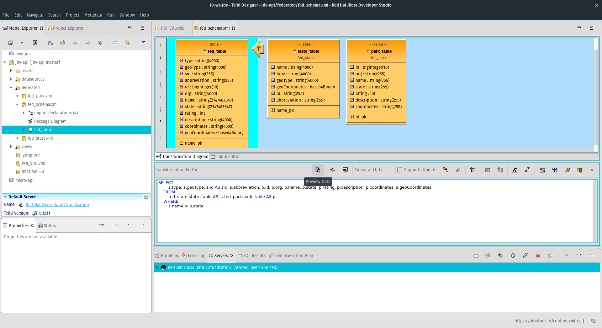

# jdv-api

A JBoss Data Virtualization project that creates an [OData](http://www.odata.org) REST api that serves federated data from Amazon S3, Relational Database, KML flat files, Solr, REST and MongoDB. 

## Build and Run
Import this project in JBoss Developer Studio (version 11.2)  as a Teiid Modeling project

## Data Details
In order for this VDB to run the datasources need to be setup and configured. There are helper [JBoss CLI](https://developer.jboss.org/wiki/CommandLineInterface) scripts to automatically create datasources on the local server.  Use the `jboss.sh` bash script in the `assets/(src)` directory. All of the datasources are required **except** for **oracle**. There are bash scripts to help with installation of solr, mongo and postgresql. Paths do no need to updated for your environment.

The Relational database is a postgresql instance on the development localhost with a database of `jboss`, username of `jboss` and password of `jboss`.  The connection driver for the database is in the `assets/sql` directory

In the `assets/mongo` directory there are node scripts for loading data into a local mongo instance.  

To load the document in the mongo folder
`node insert.js`

To remove the data
`node clean.js`

You can check connectivity to the s3 flat file with the `check.sh` script in the `assets/s3` folder

## References
[JBoss Data Virtualization](https://www.redhat.com/en/technologies/jboss-middleware/data-virtualization)

[Amazon S3](https://aws.amazon.com/s3/)

