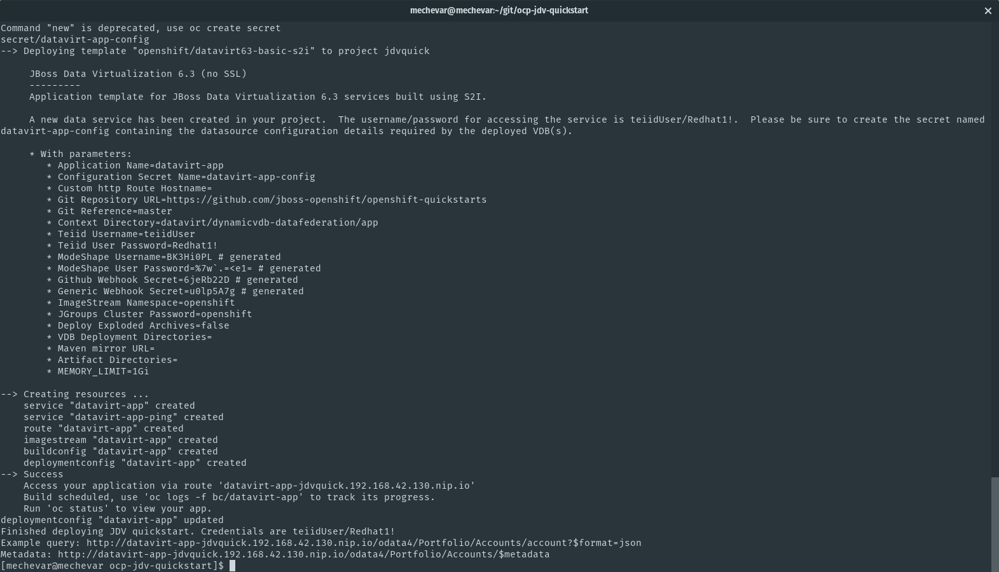

# JBoss Data Virtualization Quickstart

## About
This repo has a helper bash script to automate the deployment of the [JBoss Data Virtualization on Openshift quickstart](https://github.com/jboss-openshift/openshift-quickstarts/tree/master/datavirt/dynamicvdb-datafederation). The script in this repository automates the steps found in the documentaiton for [Red Hat JBoss Data Virtualization on Openshift](https://access.redhat.com/documentation/en-us/red_hat_jboss_data_virtualization/6.4/html-single/red_hat_jboss_data_virtualization_for_openshift/)

This script was tested on [minishift](https://docs.openshift.org/latest/minishift/index.html)

## Instructions
To get started make sure you logged into your Openshift instance

`oc login`

Afterwards run

`./setup_quickstart.sh`

This script will create a postgresql database, load data, then deploy the JDV quickstart. At the end there will be example urls to query data

## Cleanup
To remove the project and all artifacts, run

`./cleanup.sh`

The included certificates have a password of **openshift**

 
